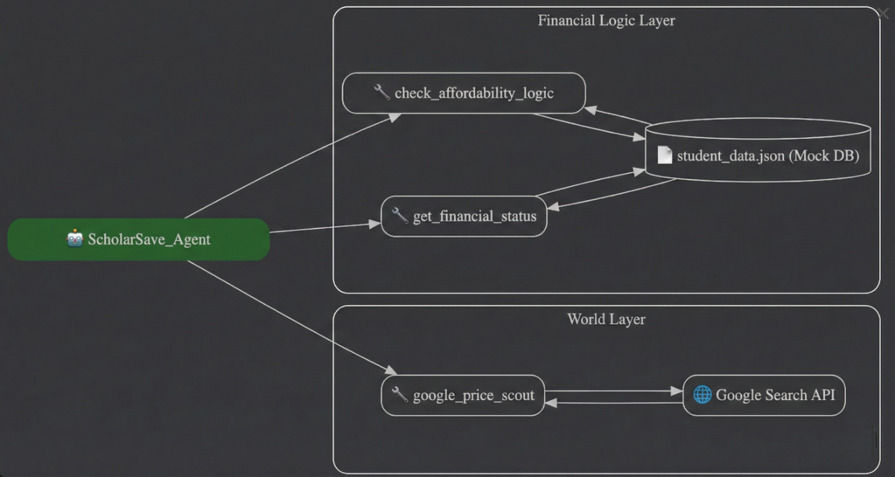

# ScholarSave: The AI Financial Guardian for Students

> **Competition Track:** Agents for Good   
> **Submission by:** Divyanshu Jaiswal

---

## The Problem: "Financial Temporal Myopia"
As a university student, my financial life is defined by a micro-budget (₹2,500/month) and irregular expenses. The core problem isn't just a lack of funds; it is **Financial Temporal Myopia**—the inability to see future costs in the present moment.

* **The Trap:** If I have ₹1,000 on Wednesday, I feel "rich."
* **The Reality:** ₹600 of that is needed for mandatory Saturday dinners (when the mess is closed) and travel.
* **The Result:** I spend the money now and face a crisis later.

Existing banking apps are **passive**. They show me what I *spent*, but they don't stop me from making a mistake *now*.

## The Solution
**ScholarSave** is an **Agentic System** that acts as a strict but helpful financial guardian. It doesn't just track numbers; it understands the **context** of student life.

### Key Capabilities:
1.  **Predictive "Vaulting":** The `check_affordability_logic` tool calculates "Ghost Expenses" (e.g., future Saturdays left in the month) and mentally "locks" that money, hiding it from my disposable balance.
2.  **Active Reasoning:** When I ask *"Can I buy this?"*, the agent checks `(Current Balance - Reserved Funds)` rather than just the total balance.
3.  **Live Price Arbitrage:** The `google_price_scout` tool uses the **Google Custom Search API** to find real-time prices for student essentials (stationery, books, travel), helping me choose between offline vs. online options.

---

## Architecture

The system uses a **ReAct (Reason + Act)** loop powered by **Google Gemini 1.5 Flash**.

*(Note: Architecture diagram showing the flow between the User, Gemini Router, and Tools)*

### Technical Stack
* **Orchestration:** `LangChain` (Python)
* **LLM:** `gemini-1.5-flash` (via `langchain-google-genai`)
* **Tools:**
    * `check_affordability_logic`: Custom Python logic for budget forecasting.
    * `get_financial_status`: Reads from the mock banking database (`student_data.json`).
    * `google_price_scout`: Connects to the **Google Custom Search API**.
* **Memory:** `ConversationBufferMemory` for context retention.

---

## How to Run

### 1. Clone the Repository
Download or clone this repository to your local machine to get the source code.

### 2. Install Dependencies
Open your terminal in the project folder and install the required libraries listed in the requirements file.

### 3. Configure Keys
Open the `main.py` file in a code editor. Replace the placeholder text with your actual **Google Gemini API Key** and **Google Search Engine ID**.

### 4. Run the Agent
Execute the main python script to launch the interactive agent in your terminal.

---

## Demo Scenarios

### Scenario A: The Strict Guardian
> **User:** "I want to buy a 600 rupee fancy notebook."  
> **Agent:** "❌ DENIED. You technically have ₹1200, but you need to reserve ₹450 for the remaining 3 Saturdays. You only have ₹150 of disposable income."

### Scenario B: The Smart Shopper
> **User:** "Find me a cheap scientific calculator."  
> **Agent:** "🔍 GOOGLE SEARCH: Casio fx-991CW is available on Amazon India for ₹1,195. Local stationery shops average ₹1,250. Suggest buying online."

---

## Future Improvements
* **OCR Integration:** Upload photos of physical bills to auto-log expenses.
* **Calendar Sync:** Connect to the University Exam Calendar to predict higher spending during exam weeks (photocopies, coffee).

---
*Built for the Kaggle AI Agents Intensive Capstone 2025.*
